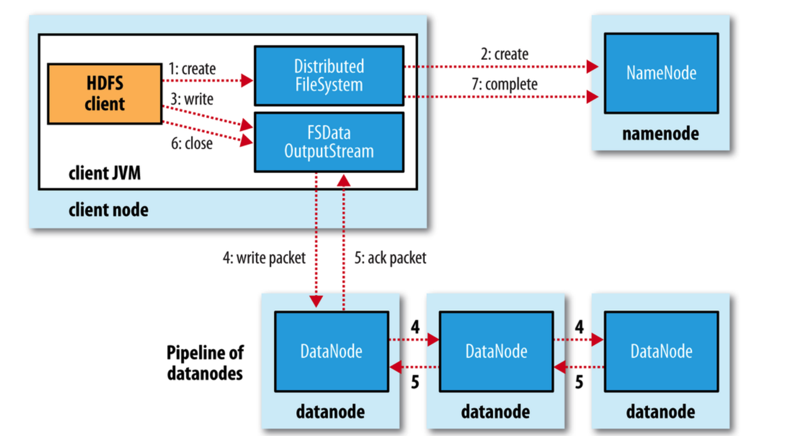
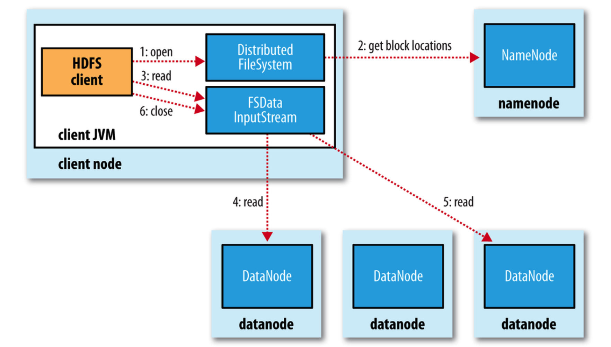
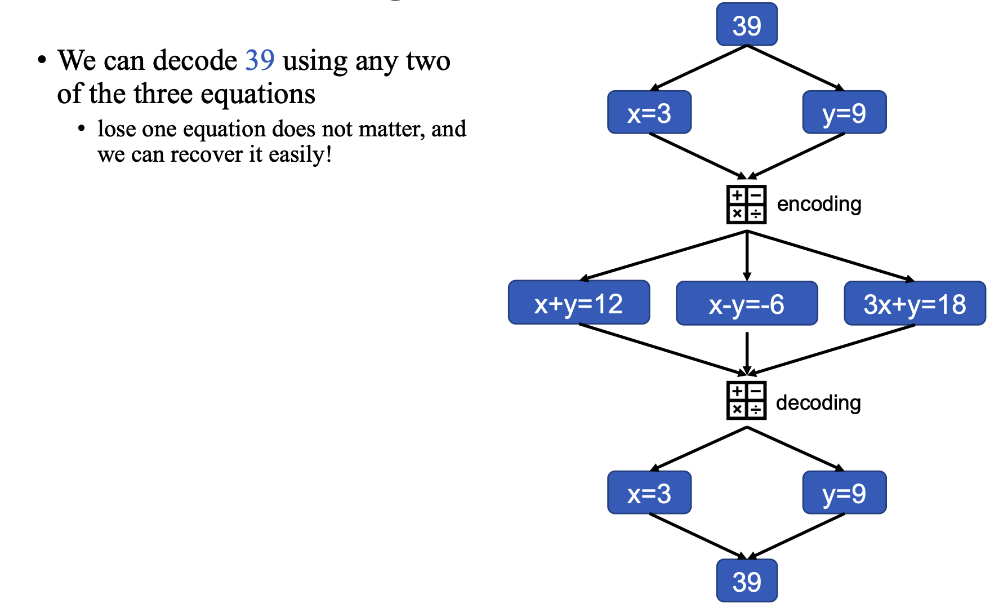

# Hadoop and HDFS

## Hadoop
* Stores big data in a **distributed** manner
* Process big data **parallelly**
* Builds on **large clusters** of **commodity hardware**

> Hadoop thus is
>
> * Scalable to large data (Volume)
> * Offering parallel data processing (Velocity)
> * Storing all kinds of data (Variety)

**It also supports**:
* Redundant, Fault-tolerant data storage (HDFS)
* Parallel computation framework (MapReduce)
* Job coordination/scheduling (YARN)

## The Master-Slave Architecture of Hadoop

The main idea behind the model is that in order to maintain a high
efficiency of computing tasks, there are multiple workers (threads)
working on several tasks. Besides, with respect to the lost/failure
problems, each task will be distributed to multiple workers.

> Wikipedia
>
> Master/slave is a model of communication where one device or process has unidirectional control over one or more other devices. In some systems a master is elected from a group of eligible devices, with the other devices acting in the role of slaves.

In the case of database, typically, the clients will read and write to
the master (some times reads are done on slaves too), and the data are
copied asynchronously to the slaves. The slaves are typically used
when the master fails or for batch processing if the client(s) don't
need live data...

## Hadoop Distributed File System (HDFS)
* [Distributed Computation] Follows Master-Slave Architecture
* [Distributed Storage] Allows storing data over multiple nodes (or machines)
* [Horizontal Scalability] Allows multiple users to access data

> Vertical Scaling refers to increase the capacity of the server while
> the server remains the same.
>
> On the other hand, Horizontal Scaling refers to add more processing
> units of physical machines to your existing server. It involves
> growing the number of nodes in the cluster and reducing the
> responsibilities of each member node by providing additional
> end-points for client connection.


## Terminologies

### NameNode (Master)
NameNode maintains and manages the blocks in the DataNodes

* Records the metadata of all the files
* Records each change to the meta data
* Regularly checks the status of datanodes
* Keeps a records of all the blocks in HDFS
* Handle data recovery, if any DataNode fails (If NameNode fails
  meaning all metadata about relations are gone, then there is no way
  to reconstruct the files from the blocks in DataNodes, thus all the
  files on HDFS will be lost)
  
> To become resilient to failure
>
> * Back up metadata in Namenode
> * Secondary NameNode

### DataNode (Slave)
A commodity hardware stores the data

* Stores actual data
* Performs the read and write requests
* Reports the health to NameNode (potential ability of being Slave)

DataNode is considered dead after 10mins that NameNode didnot heard
from. Like mentioned above, to deal with it, HDFS generates multiple
replications that guarantees data reliability. That even though one
particular DataNode is failed. The other also does its job whatsover.

* Each block has 3 replications by default
* Replications will be stored on different DataNodes
* If blocks were lost, they can be recovered from other replications
* The total consumed space is 3 times the data size

|   | NameNode | DataNode |
|:--|:--|:--|
| Quantity | One | Mutliple |
| Role | Master  | Slave  |
| Storage Object  | Metadata of files  | Blocks  |
| Hardware Requirements  | High Capacity Memory  | High Volume Hard Drive  |
| Failure Rate  | Low  | High  |
| Solution to Failure  | Secondary NameNode  | Replication  |

### Secondary NameNode
Take checkpoints of the file system metadata present on NameNode

* Stores a copy of metadata
* Periodically applies Editlogs to FsImage and refreshes the Editlogs

  > Editlogs are logs commiting modifications recently
  >
  > FsImages are the file system namespace

* If NameNode is failed, File System metadata can be recovered from
  the last saved FsImage on the Secondary NameNode

```
                        Query editlogs
                   ------------------------> 
Secondary NameNode                           NameNode
       ----        <------------------------
       \  /        Copy the updated FsImage
        \/
self-updates FsImage
```

### Blocks
Block is a sequence of bytes that stores data. A file is separated
into multiple blocks (e.g., A 330 MB file contains three blocks that
are 128 MB, 128 MB and 74 MB)

Image the block size of being small, then the number of blocks will be
accordingly large. So are the metadata in NameNode. In that case, too
many seeks affects the read speed essentially harms the performance of MapReduce.

$$ \omega \text{(Fail Rate Per Second)} = FPD / (24 * 3600) $$
$$ \text{MPS} = \text{Replication Speed in Megabytes per second per node} $$

## Independent Failure

## Simultaneous Failure
It is the scenario when one DataNode fails, there are other nodes also
fails meaning we lost $B$ first replicas for the first DataNode and
some of the second replicas and more first replicas.

If the third node fails, we would have lost some third replicas, some
second replicas and most of the first replicas.

Assume $k$ of $N$ nodes have failed simultaneously, we denote

* $L_1(k, N)$ blocks have lost one replica
* $L_2(k, N)$ blocks have lost two replicas
* $L_3(k, N)$ blocks have lost three replicas
* $B$ is the number of unavailable blocks if one node fails

When $k = 0$:

* $L_1(0, N) = L_2(0, N) = L_3(0, N) = 0$

When $k = 1$:

* $L_1(1, N) = B$
* $L_2(1, N) = L_3(1, N) = 0$

When $k = 2$:

* $L_1(2, N) = 2 * B - 2 * L_2(2, N)$

  > Vene graph: union = A + B - intersection.

* $L_2(2, N) = 2 * L_1(2, N) / (N - 1)$

  > $L_1(1,N)$ is the # of blocks that have already lost one replica.
  > We denote the set of these blocks as A. For each block in A, there
  > are 2 live replicas out there, and we assume that these replicas
  > are uniformly distributed over the other N-1 nodes.
  >
  > Therefore, for each node, the expected number of replicas that
  > corresponds to blocks in A is $2*L_1(1,N) / (N-1)$.
  >
  > Hence, when the 2nd node fails (e.g., one of these N-1 nodes), we
  > expect to have $2*L_1(1,N) / (N-1)$ blocks that lose their 2nd
  > replica.
  
* $L_3(2, N) = 0$

When $k = 3$:

* $L_1(3, N) = 

### Rack Awareness Algorithm

> A **rack** is a collection of 30 or 40 nodes that are physically
> stored close together and are all connected to the same network
> switch. Network bandwidth between any two nodes in **rack** is
> greater than bandwidth between two nodes on different racks.

* The data transportation speed between nodes in different racks are
  *low*
* The data transportation speed between nodes in the same racks are
  *high*
  
* If the replication factor = 3:
  1. replica will be stored on the local DataNode
  2. replica on a different rack from the first
  3. replica on the same rack as 2., but on a different DataNode
  
#### Reason

* Reduce latency
  * For Writing: reduce the number of writing to 2 racks instead of 3
    per block
  * For Reading: consider fault tolerance, increase the reading from
    multiple racks
    
## Write and Read in HDFS

### Write in HDFS

* Contains three main phase:
  1. Create the file
    1. HDFS client calls `create` function on the Distributed
       FileSystem
    2. Distributed FileSystem calls `create` function on the NameNode
       to allocate/assign blocks for storing Metadata
    3. NameNode perform `check` function to check the existance and
       permission of that file
    4. Distributed FileSystem  calls `create` a FSData OutputStream
  2. Write the file
    1. HDFS client splits file into blocks and transmit to FDS
       OutputStream
    2. FSData OutputStream splits data into packets
    3. Start writing packets to a data queue containing three
       DataNodes (Pipeline of datanodes)
    4. DataNode sends ack package to OutputStream
  3. Close the file
    1. HDFS client calls `close` funcion on FSData OutputStream
    

  
* There is only **single** writer (HDFS client) allowed at any time
  * Reject request from other HDFS client is about to modify the same
    file - locks
* The blocks are writing **simultaneously** from the same file (multiple blocks of the same file).
* The replications are replicating **sequentially** (pipeline)

### Read in HDFS

1. HDFS client `open` Distributed FileSystem and `query` NameNode
   about READ block locations (metadata)
2. HDFS client `read` file through FSData InputStream within all
   related (**closest**) DataNodes
3. HDFS client `close` the InputStream



* Multiple readers are allowed to read at the same time
* The blocks are reading **simultaneously**
* Always choose the **closest** DataNodes to the client (Network
  Topology)
* If a block in a DataNode is corrupted, the NameNode will make a
  record to avoid visiting again and find the second closest DataNode
  accordingly
  
## HDFS Erasure Coding

### Drawbacks
1. The replicas occupies tons of space (over 200%)
2. Some replicas are rarely accessed

### Idea

Content can be encoded by using multiple variables and decoded by
solving system of equations.




In general, data locality refers the process of placing computation
near to data, which helps in high throughput and faster execution of
data. Data locality in Hadoop means moving computation close to data
rather than moving data towards computation.

Data locality minimizes the network congestion and increases the
overall throughput.
