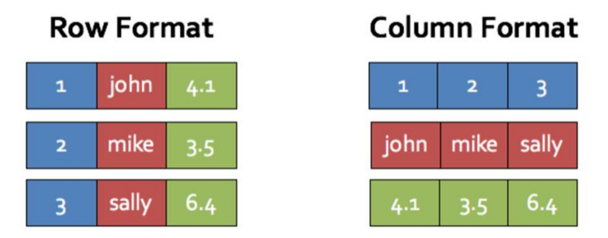

# Spark SQL

## DataFrame

A DataFrame is a distributed collection of data organized into named columns.

### Features

* Ability to scale from kilobytes of data on a single laptop to petabytes on a large cluster
* Support for a wide array of data formats and storage systems
* State-of-the-art optimization and code generation through the Spark SQL Catalyst optimizer
* Seamless integration with all big data tooling and infrastructure via Spark
* Polyglot APIs for Python, Java, Scala and R

### Relationship to Spark RDD

DataFrames are built on top of the Spark RDD API (i.e., you can run normal RDD operations on DataFrames); however, RDD operations will often give you back an RDD, not a DataFrame. The DataFrame API is likely to be more efficient because it can optimize the underlying operations with Catalyst.

As mentioned that DataFrames are built on top of the Spark RDD API, DataFrames are also lazy evluated. Transformations contributes to the query plan, but they don't execute anything.

DataFrame is more like a traditional database of two dimensional form, in addition to data, also there are schema of the strcuture information. On the other hands, RDD is constructed with type parameters (implies the class information), but the Spark framework does not understand internal structure of class.

DataFrames can be significantly faster than RDDs, And they perform the same, regardless of the language.

## Column Storage

DataFrames use column storage so the data in each column (with the same type) are packed together.

