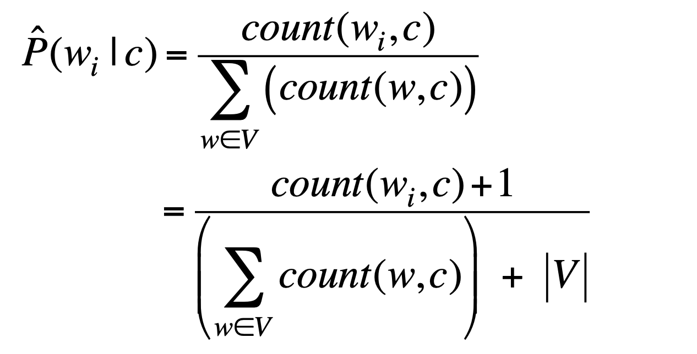

# Classification and PySpark MLlib

## PySpark MLlib

MLlib is Spark's scalable machine learning library supporting common algorithms and utilities including
* Basic statistics
* Classification
* Regression
* Clustering
* Recommendation System
* Dimensionality Reduction
* Optimization

> Comparing `Scikit-Learn` and `MLlib`
> * `Scikit-Learn` has better performance for small or medium sized datasets (i.e., fits RAM)
> * `MLlib` is computationally efficient for large datasets.

## Classification & Regression

### Introduction

Classification aims to **predict categorical class labels** and construct a model based on the training set and the values (class labels) in a classifying attribute and uses it in classifying new data.

Regression aims to models continuous-valued functions (i.e., company quarter revenues).

### Definition

Given a new object $o$, map it to a feature vector $\vec{o} = (x_1, x_2, \ldots, x_d)^T$. Predict the output.

* Classification: $f(\vec{x}): \mathbb{R}^d \mapsto y$
  * Binary classification: $y = \{0, 1\}$ or $\{-1, 1\}$
  * Multi-class classification $y = \{1,2,\ldots,C\}$
* Regression: $f(\vec{x}): \mathbb{R}^d \mapsto \mathbb{R}$

### Model

* Classification
  * NLP
    * Input: generate input feature vectors
    * Output: class labels
    * Method: Naive Bayes/Logistic regression/SVM
  * Image Recognition
    * Input: a matrix of RGB values
    * Input features: color histogram
    * Output: class labels

### Process

1. Pre-processing and feature engineering (find the appropriate feature generating feature vectors)
2. Train the classifier
3. Evaluate the classifier

## Learning method

### Supervised Learning

1. Supervised learning has input labelled data consisting,
    * \# instances by \# attributes matrix
    * \# attributes = \# features + 1 (i.e., label)
2. Labelled data split into 2 or 3 disjoint subsets as
    * Training data (build a classifier)
    * Development data (select a classifier)
    * Testing data (evaluate a classifier)
3. Output of classifier
    * Binary classification $\{0, 1\}$
    * Multi-class classification $\{1, 2, \ldots, C\}$

### Evaluate Classifier

* False Positive: `False` but classified as `True` (falsely True)
* False Negative: `True` but classified as `False` (falsely False)
* True Positive: `True` and classified as `True`
$\\[1ex]$
* Precision = $\dfrac{tp}{tp+fp}$
$\\[1ex]$
* Recall = $\dfrac{tp}{tp+fn}$
$\\[1ex]$
* $F_1$ score = $2 \cdot \dfrac{\text{precision} \cdot \text{recall}}{\text{precision} + \text{recall}}$

**Testing set must be independent of training set, or over-fitting will occur**

### Evaluation baseline

1. Based on testing error, otherwise leading to over-fitting (i.e., training error potentially low as model trained to fit the training data)
2. Sometimes, the model does not perform well on testing set, yet feed part of the testing set into the model is also not acceptable. Then you can further split the development set from training set
3. Efficient and correct way of validate accuracy of development set with `k_fold_cross_validation`
  > K fold cross validation splits development set into K disjoint subset. Every time training the model, use 1 of the subset as testing set against others as training set in total K times.

## Classifier

### Naive Bayes

Bayes' Rule:
* For a document $d$ and a class $C$
  $$ P(c \mid d) = \dfrac{P(d \mid c)P(c)}{P(d)} $$
* Then we want maximum a posteriori estimation
  $$ C_{MAP} = \argmax_{c \in C} P(c \mid d)\\
             = \argmax_{c \in C} P(d \mid c) \cdot P(c)\\
             = \argmax_{c \in C} P(x_1,\ldots,x_n \mid c) \cdot P(c)$$
* Need to examine $O(|X|^n \cdot |C|)$ parameters
> MAP helps when we have a prior probability/distribution (i.e., the probability of obtaining each class are different)

### Multinomial Naive Bayes

Multinomial Naive Bayes Independent Assumption
$$ P(x_1,x_2,\ldots,x_n \mid c) $$
* Bag of Words assumption: assume position does not matter
* Conditional Independence: assume the feature probability $P(x_i \mid c_j)$ are independent given the class $c$
$$ P(x_1,\ldots,x_n \mid c) = P(x_1 \mid c) \bullet P(x_2 \mid c) \bullet \cdots \bullet P(x_n \mid c) \\[2ex]
C_{NB} = \argmax_{c_j \in C} P(c_j) \prod_{i \in \text{positions}}P(x_j \mid c_j) $$

## Estimation

### MLE vs. MAP

The problem with MLE is that is highly affected by the zero (i.e., frequency would be zero if the word does not appear). However, zero cannot be conditioned away.

### Smoothing

Laplace smoothing for Naive Bayes is by reserving a small amount of probability for unseen probabilities.

## Pipeline

A pipeline is specified as a sequence of stages that
* each stage is either a Transformer or an Estimator
* stages are run in order
* the input DataFrame is transformed as it passes through each stage

### Transformer

A Transformer is an algorithm which can transform one DataFrame into another. E.g., an ML model is a Transformer which transforms DataFrame with features into another DataFrames with predictions.

> The `transformer()` method is called on the DataFrame

### Estimator

An estimator is an algorithm which can be fit on a DataFrame to produce a Transformer.

> The `fit()` method is called to produce a Transformer.
> Then Transformer's `transform()` method is called on the DataFrame